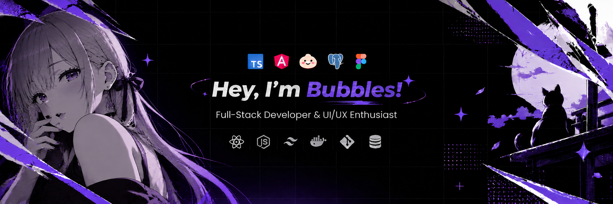

Building thoughtful digital experiences through code &amp; design.

Brazil 🇧🇷 &nbsp;·&nbsp; 19 years old &nbsp;·&nbsp; @Bolhass

### A little about me

I'm **Anderson**, also known as **Bubbles**. I'm a full-stack developer who enjoys building modern applications and simple, intuitive interfaces.

I enjoy learning new technologies, exploring automation, and working on personal projects.

### What I work with

  &nbsp;&nbsp;
  &nbsp;&nbsp;
  &nbsp;&nbsp;
  &nbsp;&nbsp;
  &nbsp;&nbsp;
  &nbsp;&nbsp;
  &nbsp;&nbsp;
  &nbsp;&nbsp;
  &nbsp;&nbsp;
  &nbsp;&nbsp;
  

### GitHub stats

  

---

✦ &nbsp; Keep building, keep learning. &nbsp; ✦

